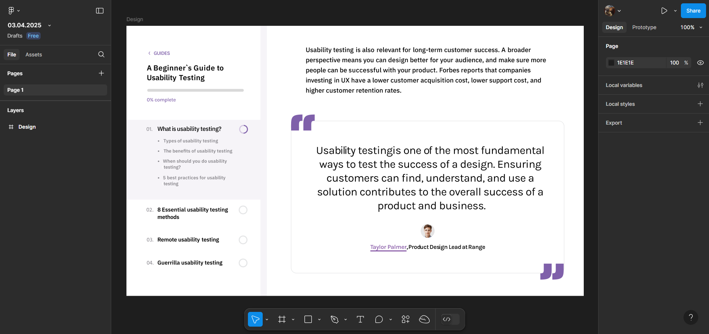

# ПЗ-7: Робота з текстом у Figma

## Опанування інструментів
У цій роботі ми навчимося працювати з текстовими об'єктами у Figma, налаштовувати типографіку та використовувати стилі тексту для створення структурованих макетів.

### Завдання
- Переглянути навчальне відео.
- Виконати завдання із файлу **Figma 3**.
- Оформити текстові блоки відповідно до завдань.
- Використати стилі тексту для заголовків і абзаців.
- Налаштувати вирівнювання та міжрядковий інтервал.
- Прикріпити знімок екрану та посилання на виконане завдання у Figma.

### Результати

#### Виконане завдання

  

### Процес створення
1. Додавання текстових блоків та налаштування їхніх параметрів.
2. Використання стилів тексту для уніфікації оформлення.
3. Налаштування розміру, шрифту, кольору та інтервалів між рядками.
4. Вирівнювання тексту та створення логічної структури макету.
5. Перевірка та внесення правок для досягнення гармонійного дизайну.

### Висновок
У ході виконання роботи було опановано базові навички роботи з текстом у Figma, що дозволяє створювати акуратні та зручні для читання макети. Отримані знання стануть у пригоді при створенні UI/UX-дизайну та оформленні цифрових інтерфейсів.

### Посилання на проект у Figma
[Переглянути проект](https://www.figma.com/design/kwKQFDnnl0Pu7pEZOuu3do/03.04.2025?node-id=0-1&p=f&t=bGODUlRjqa9utoi4-0)
